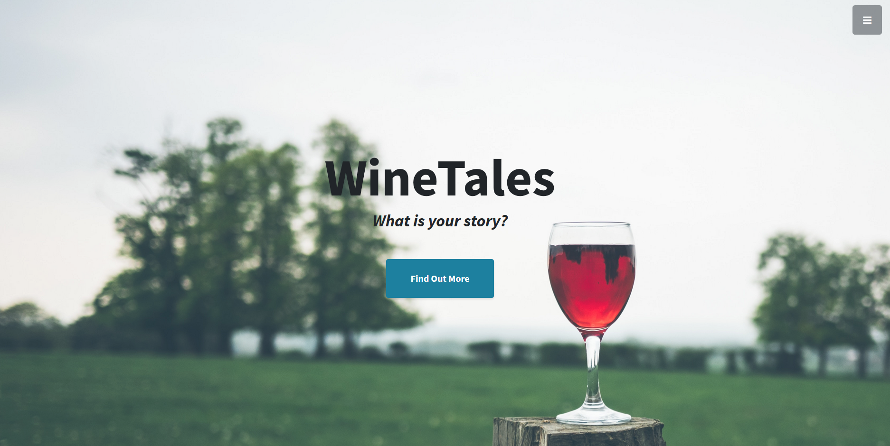
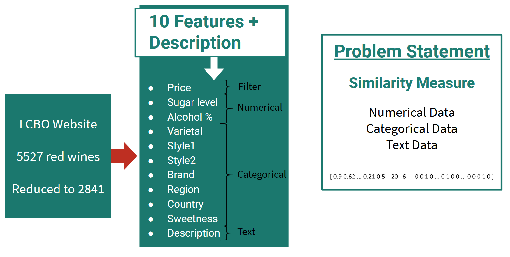
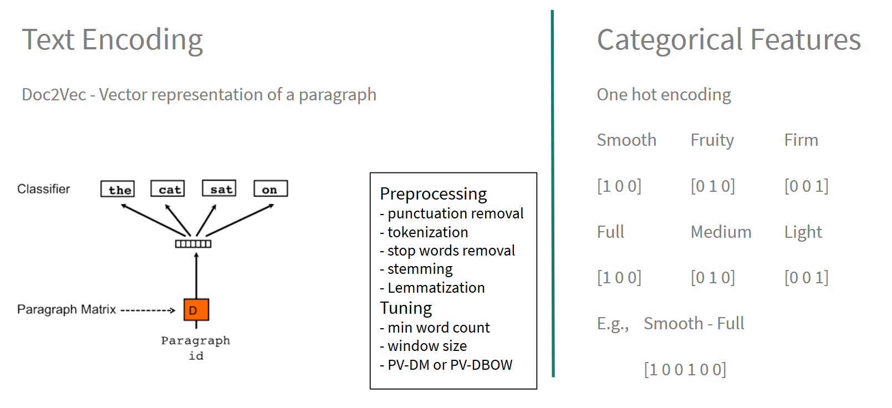
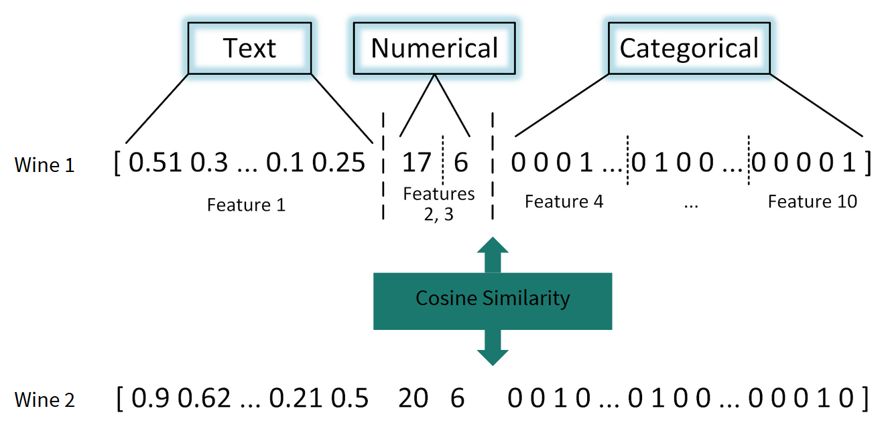
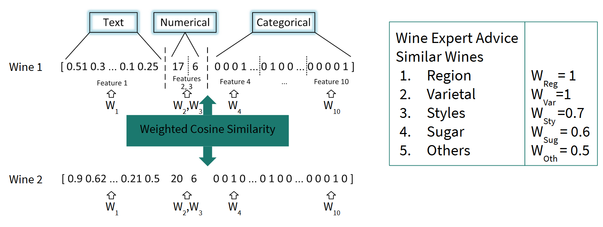
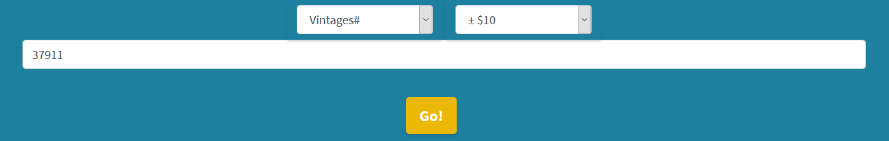
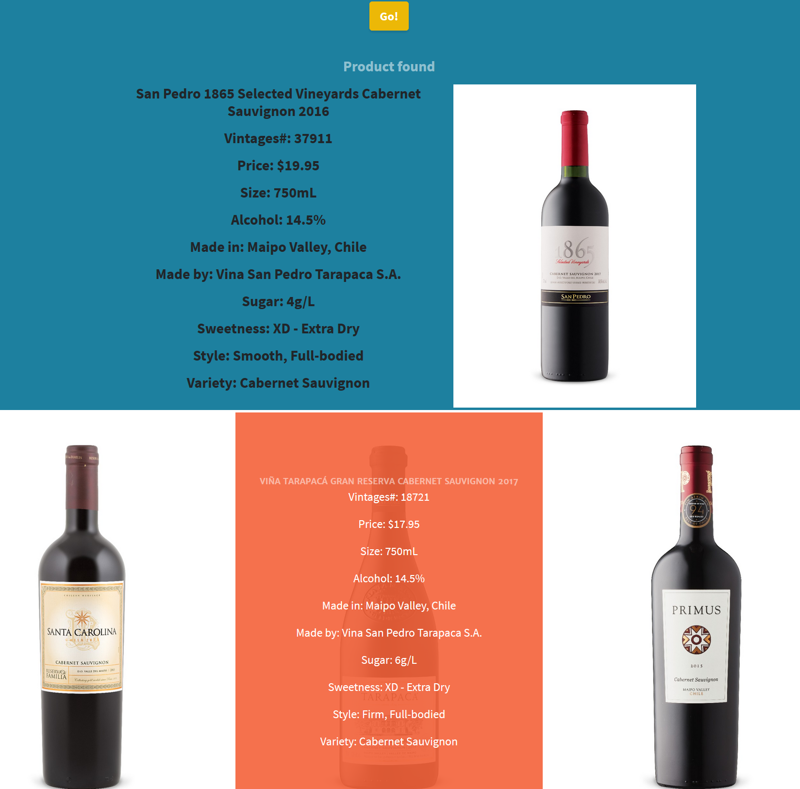
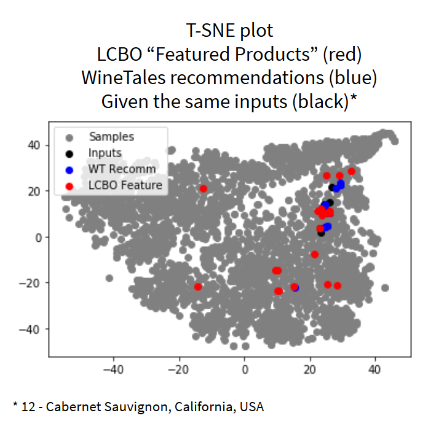
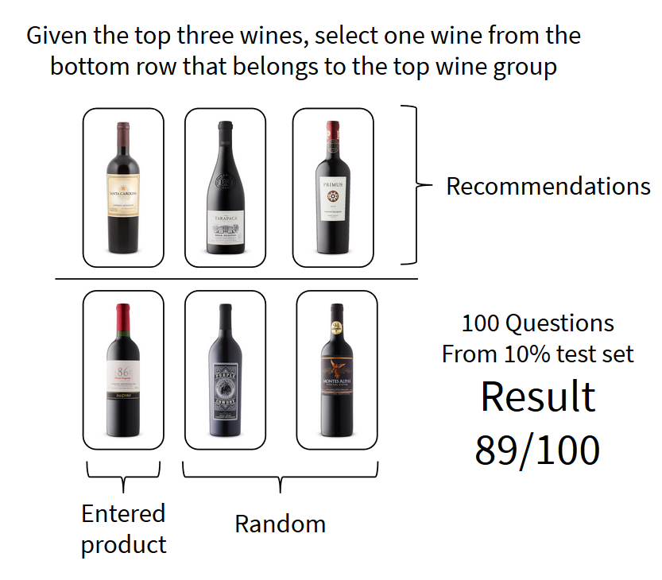
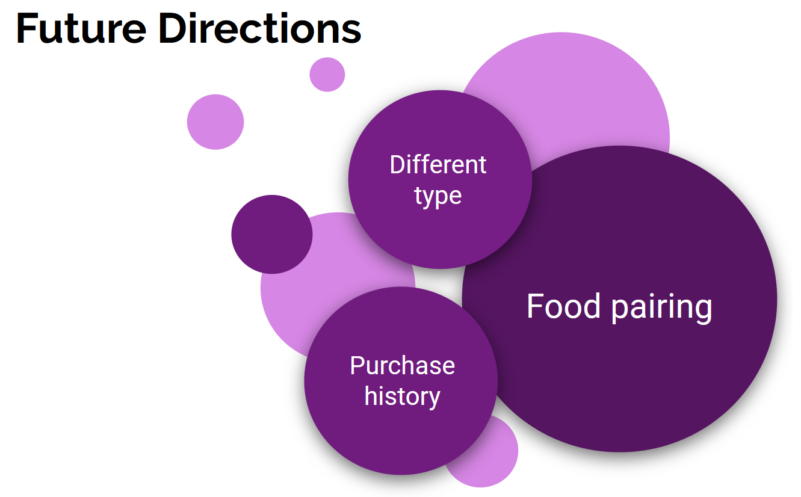

# WineTales: Wine recommendation system for red wines

Have you had an experience where you remember having a great wine at an event such as a wedding and would like to find a similar product to try it again? More than 10,000 wine grape varieties and 100k available products worldwide can make it difficult to know where to start.

WineTales is a recommendation system that takes the information of a wine product and provides three similar products that you can find at your local liquor store. The system combines numerical, categorical, and text data to characterize each wine product and uses weighted cosine similarity to find similar products for the recommendations.

You can check out the web-app at www.winetales.live

## Outline

This document consists of seven sections:

1. [Outline](#outline)
1. [Getting Started](#getting-started)
1. [Folder Description](#folder-description)
1. [WineTales: Data Scraping, Cleaning](#winetales:-data-scraping,-cleaning)
1. [WineTales: Model Development](#winetales:-model-development)
1. [WineTales: Web App](#winetales:-web-app)
1. [WineTales: Validation](#winetales:-validation)
1. [Conclusion](#conclusion)
1. [Author](#author)

The project consists of four parts, which are data scraping/cleaning, model development, validation, and web app. Each parts are elaborated in the respective sections.

## Getting Started

These instructions will get you a copy of the project up and running on your local machine for development and testing purposes. See deployment for notes on how to deploy the project on a live system.

### Prerequisites

The following are Python packages used in this project.

```
beautifulsoup4            4.8.0                    
flask                     1.1.1                      
gensim                    3.8.0                    
matplotlib                3.1.1                    
nltk                      3.4.5                    
numpy                     1.16.5           
pandas                    0.25.1                   
scikit-learn              0.21.3                   
scipy                     1.3.1 
```

### Installing

You can use pip install package_name command to install each package on your local machine. For example, to install beautifulsoup4, use the following command. I used Anaconda 3 on Windows 10.

```
pip install beautifulsoup4
```

Here are the rest of the package installation commands

```
pip install flask
pip install gensim
pip install matplotlib
pip install nltk      
pip install numpy     
pip install pandas    
pip install scikit-learn
pip install scipy       
```

## Folder Description
There are six directories in the repo. The details of the structure of the repo is described in the following.

* /data

Data folder contains relevant data used for the recommendation engine. Data formats are in CSV, Excel, and pickle. The folder divides into four subdirectories, which are raw, cleaned, validation, and for_models. As the names suggest, raw contains unprocessed data, cleaned contain cleaned data, validation contains data used for the validation of the model and for_model contains the data set that were used to train the models. 
The data is scraped data on the red wine category from the LCBO website. 
* /models

This folder contains doc2vec model that was trained based on the description text.
* /notebooks

This folder contains Jupyter notebook files that were used present examples of the working code.
* /script

Script contains Python files that were used to create the model of the WineTales system including web scraping tools and recommendation engine of the system. There are four subdirectories for each component of the system. 
scrape folder contains LCBO_scrape_tools.py and lcbo_navigate_scrape_main.py. The former contains functions based on Beautifulsoup that extracts information from a LCBO wine product webpage. The latter helps to navigate the website and contains functions that exports the scraped data to CSV files. 
Data_cleaning folder contains Python files that were used to process the raw data that was scraped.
Model_development folder contains python files that processed and generated the final model for the system including encoding of text and categorical data, training of Doc2Vec model, generating the weight vector and matrix of the weighted cosine similarity.
Validation folder contains scripts that were used to generate the validation questionnaires and process the responds to calculate the accuracy.
* /validation

This folder contains the questionnaire and results of the questionnaire for the validation of the model
* /WineTalesApp

Contains Python script based on Flask as well as HTML, css, js files used to generate the WineTales web app.

## WineTales: Data Scraping, Cleaning

WineTales is based on the red wine data scraped from the LCBO website. The scripts used to scrape the data are contained in /script/scrape. Beautifulsoup4 was used to retrieve the HTML file, and further processing was done to extract the relevant information. 

After scraping 5527 red wine products (i.e., samples), data samples with missing data and duplicate (i.e., same wine but different size) were removed. The total number of samples was 2841 after the cleaning. The scripts used to clean the data are contained in /script/data_cleaning

Each product contained 11 features. The features include price, sugar level, alcohol percentage, varietal, style 1, style 2, brand, region, country, sweetness, and description. Since the price feature was used as a filter, ten features were used to develop the model. There were two numerical, seven categorical, and one text features, which needed to be translated into a numerical vector.



## WineTales: Model Development

As stated above, different types of data had to be encoded so that they could be used in a model. The data types that required encoding were the text and categorical data. The text data, which was the description of the product, was encoded using Doc2Vec model after the raw data were preprocessed. Ninety percent of the data were used to train the model using the following hyperparameters. 
* max_epochs = 50
* vec_size = 50
* alpha = 0.025
* window_size = 2
* num_workers = 4
* minimun_count = 1
* PV-DBOW

Once the text data was encoded, categorical data were then encoded using one-hot encoding. 



The encoded vectors were combined along with numerical variables to produce an aggregated vector that described the entirety of the product. This vector was formed for every product where cosine similarity could be used to measure the similarity between products. 



One last piece that was incorporated into the model was the priority of the features in selecting similar wines. Wines can differ widely depending on the region and by varietal followed by other features such as style and sugar level. Given this information, the weighted cosine similarity that took account of this information was applied. The weights were determined empirically.



The scripts used to develop the model are in /script/model_development.


## WineTales: Web App

The web app was developed based on the recommendation model developed above using Flask. The script and all relevant files are contained in /WineTalesApp. The web app uses hashing to access the pre-calculated weighted cosine similarity score matrix to find the recommended products. This approach saves computational resources and thus expedites the loading process.

The web app takes the LCBO product number as an input and outputs the three recommendations along with the product entered as shown below. The user can set the price range to be within 5, 10 dollars of the price of the input product, or decide not to use the price filter. 





## WineTales: Validation

While the recommendation model and web app work, the outputs generated by the engine should be validated.

First of all, the recommendation was given more context by comparing the recommendations to the products generated by the LCBO website. Twelve similar wine products were selected and were used as inputs to the WineTales system to make the recommendations. The same products also had recommended products generated by the LCBO website (i.e., the phrase that was used on the website was "Featured Products." While the website provides these "featured products", only a small fraction of the product catalogue comes with the recommendations. Using T-SNE method, the products were plotted to make a comparison. In the figure below, black dots represent the input products, blue dots represent the recommended products by the WineTales, and the red dots represent the recommendations generated by the LCBO website. A clear distinction can be made in terms of clustering where the WineTales recommendations form closer cluster than that of the LCBO website.



The validation of the recommendations was done through a survey. Out of the 10% test set, 100 products were randomly selected. A product consultant of LCBO was asked to answer the following question. Given the top three wines, which are the recommendations, the consultant had to select one wine that is similar to the top three wines. One of the options is the wine that was used to generate the recommendations, and the other wines were random. Higher than 33% accuracy indicated that the system was performing better than random. The result was 89%.




## Conclusion

WineTales recommendation system is a product with high potentials. In addition to the similar wine recommendations, the system can expand to include recommending different types of wines, provide information on food-pairing, and incorporate the purchase history of the user to customize the experience for the user. 



## Author

As of October 2019, Isaac Sung Jae Chang is a fellow at Insight Data Science Program. WineTales project was conducted as part of the development work included during the program. He recently finished his Ph.D. in biomedical engineering specialized in the physiological signal analysis and unobtrusive monitoring solutions. Visit his LinkedIn page to know more.
https://www.linkedin.com/in/isaac-chang/